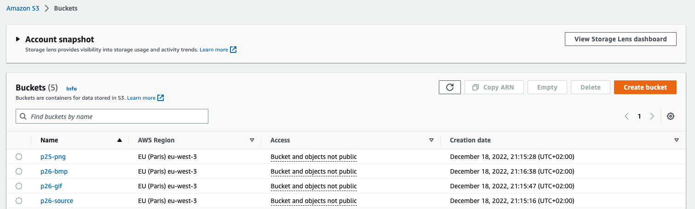
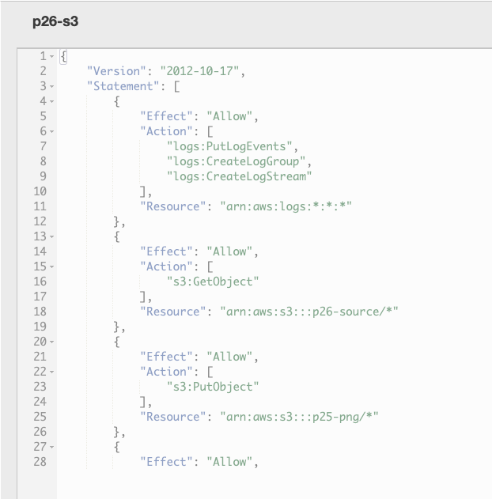
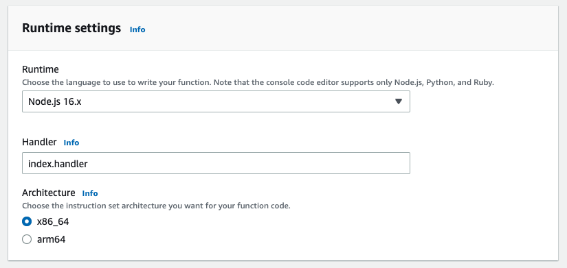
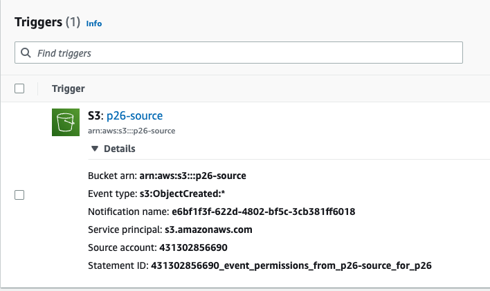
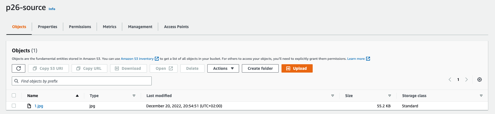
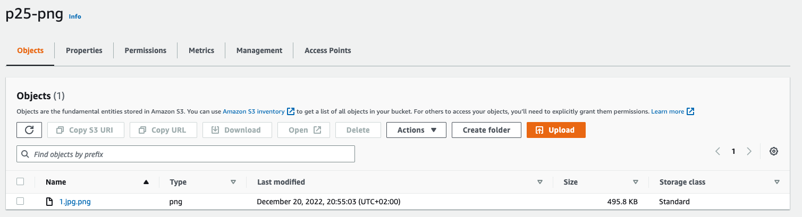
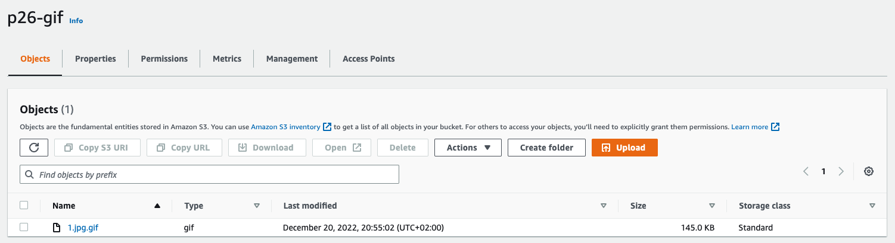

# AWS: Serverless calculations

The main function logic is located in the `src/index.js` file. Run np install commands to install dependencies

```shell
npm install --platform=linux --arch=x64 aws-sdk
npm install --platform=linux --arch=x64 sharp
npm install --platform=linux --arch=x64 utils
```

Create a zip archive and upload to lambda

#### Created buckets 



#### Created IAM policy and role to provide access



#### Created Lambda function



#### Added trigger



### Result:

